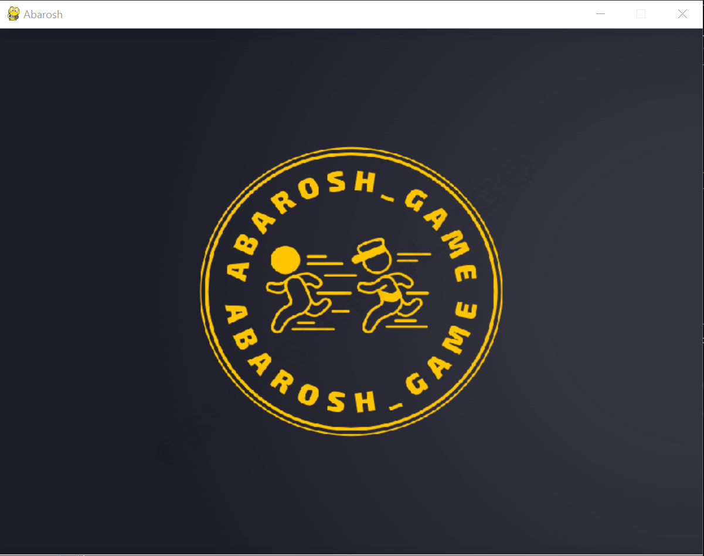
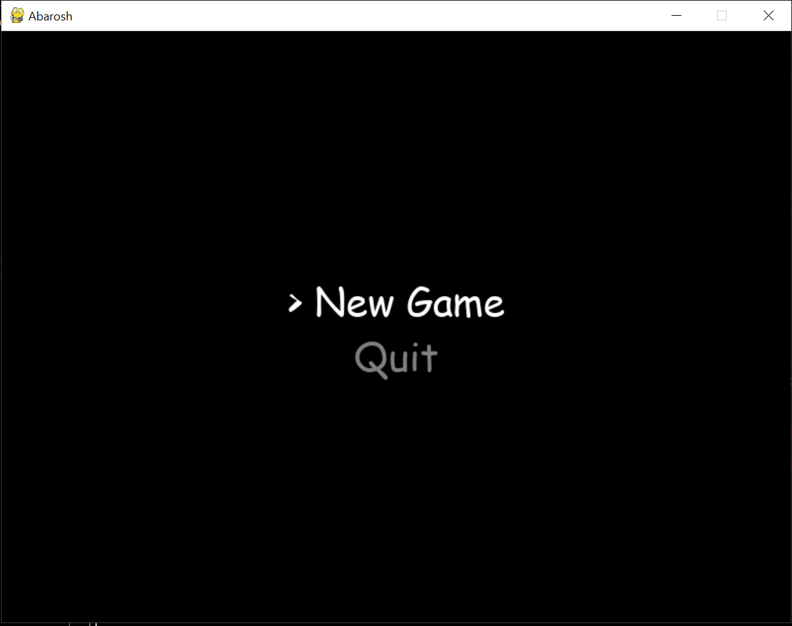
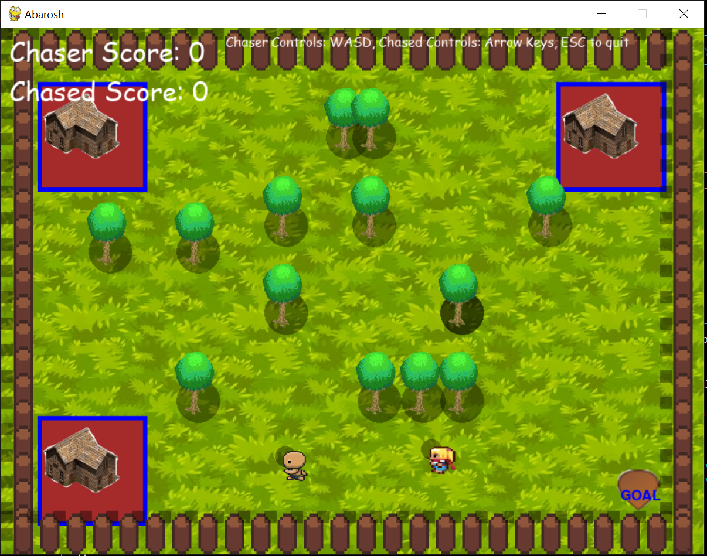
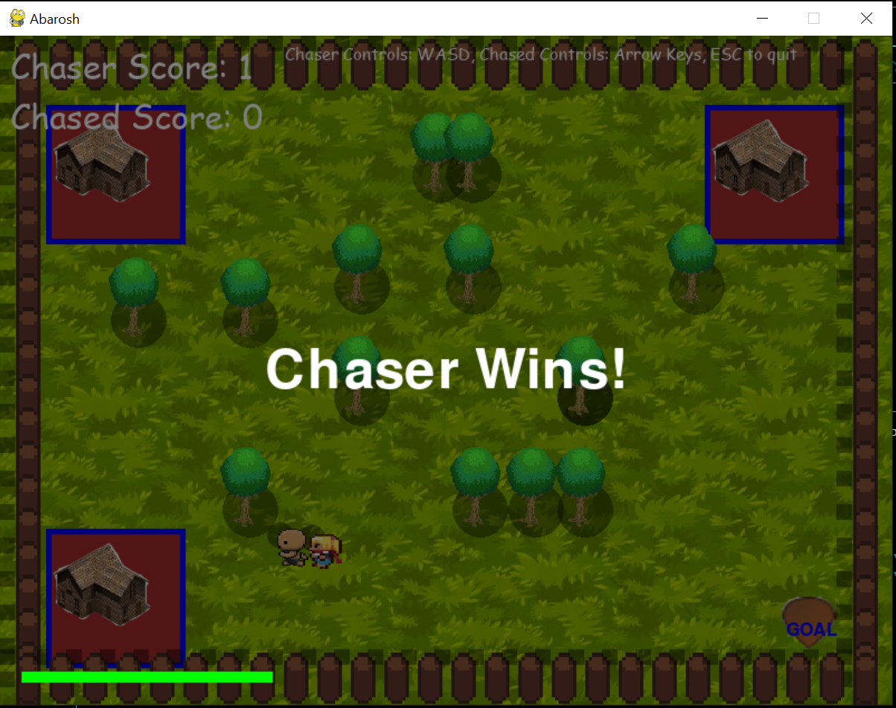

# Abarosh_chasing_game

Welcome to the Tag/Chase Game project! This is a thrilling two-player game where you can engage in an exciting chase. The game is played on a game field with three corners where the runner can rest and the chaser cannot enter. The objective for the runner is to outrun the chaser and reach the goal position without being caught.

## Objective

The objective of the game is to either be the chaser and catch the runner, or to be the runner and reach the goal position without being caught. The game field is designed with strategic resting corners for the runner, providing temporary sanctuary from the chaser. Use your speed, agility, and strategic thinking to outmaneuver your opponent and achieve your objective.

## Screenshots

Here are some screenshots from the game:

### Splash Screen

### Menu Screen

### Game Play Screen

### Game Over Screen

## How to Play
1. **Setup**: Start the game on your computer. The chaser's goal is to catch the runner, while the runner's goal is to reach the goal position without being caught.

2. **Start**: The game begins with one player designated as the chaser and the other player as the runner. The chaser's initial position is outside the resting corners, while the runner starts at a designated starting point.

3. **Chase**: The chaser can move freely around the game field, while the runner must navigate through the obstacles and attempt to outrun the chaser. The chaser cannot enter the resting corners, providing temporary safety for the runner.

4. **Resting Corners**: The runner can strategically choose to rest in one of the three corners of the game field. While in a resting corner, the chaser cannot enter or tag the runner. The runner can rest in a corner for a limited time before continuing their escape.

5. **Goal Position**: The runner's objective is to reach the goal position located in the game field without being caught by the chaser. If the runner successfully reaches the goal position, they win the round. If the chaser catches the runner before reaching the goal position, the chaser wins the round.

6. **Role Switch**: After each round, the roles switch. The runner becomes the chaser, and the chaser becomes the runner. This allows both players to experience both roles throughout the game.

7. **Multiple Rounds**: You can choose to play multiple rounds and keep track of the number of successful escapes or catches to determine the ultimate winner.Remember to communicate, strategize, and enjoy the excitement of the chase!**Note**: This is a school project and currently does not include power-ups. The game is designed for two players playing on the same computer.

## Upcoming Features

- [ ] Power-ups
- [ ] Multiple levels
- [ ] Multiple game modes
- [ ] Multiple game fields
- [ ] Switching roles during game play